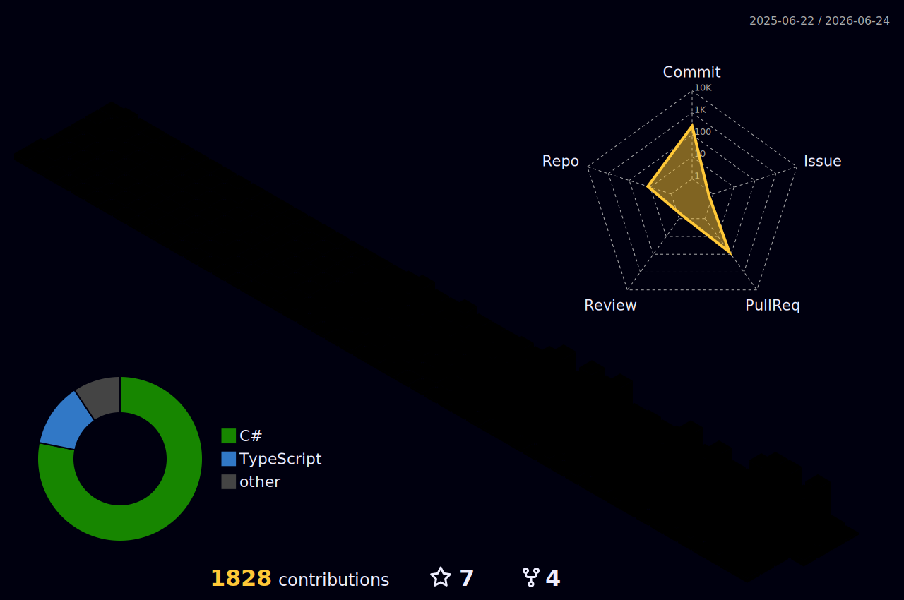

# Hi, I'm Evgeni Bondarev 👋

<p align="center">
  <b>AI Founder • Indie Hacker • .NET Developer</b>
</p>

<p align="center">
Building AI products, automation tools and SaaS applications.
</p>

---

## 🚀 Featured Projects

### Nova3D

AI-powered 3D generation platform.

### ProductRadar

Platform for discovering new products and startups.

### Task Extraction

Extract tasks automatically from chats and messages.

### Telegram Automation

Bots and workflows for business automation.

---

## 🧠 What I Build

* AI-powered tools & SaaS
* Telegram automation systems
* LLM-based workflows
* Developer productivity tools
* Startup MVPs

---

## 🛠 Tech Stack

<p align="center">

</p>

---

## 🌈 3D Contribution Graph

Один из самых сильных визуальных эффектов для GitHub профиля.

### 👉 3D GitHub Activity

Используется генератор:

* https://github.com/yoshi389111/github-profile-3d-contrib

После настройки добавь в профиль:

```markdown id="3dgraph"
## 🌈 Contribution 3D Graph


```

---

## 🏙 GitHub Skyline (реальный 3D мир)

Самый “вау” эффект из всех — твои коммиты превращаются в 3D-город.

* https://skyline.github.com

Ты можешь:

* сгенерировать 3D город
* скачать изображение или GIF
* вставить в README

```markdown id="skyline"
## 🏙 GitHub Skyline


```

---

## ⚡ Contribution Snake

```markdown id="snake"

```

---

## 📊 GitHub Stats

<p align="center">


</p>

---

## 💡 Philosophy

Build fast.
Ship often.
Improve every day.
Talk to users.

---

<p align="center">
🚀 Building AI products that ship.
</p>
